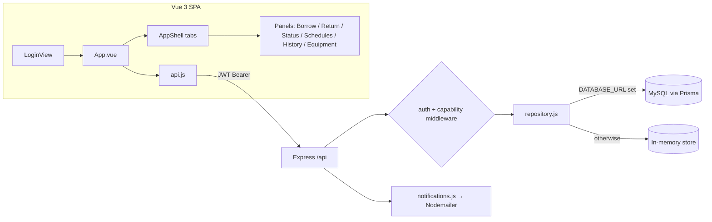
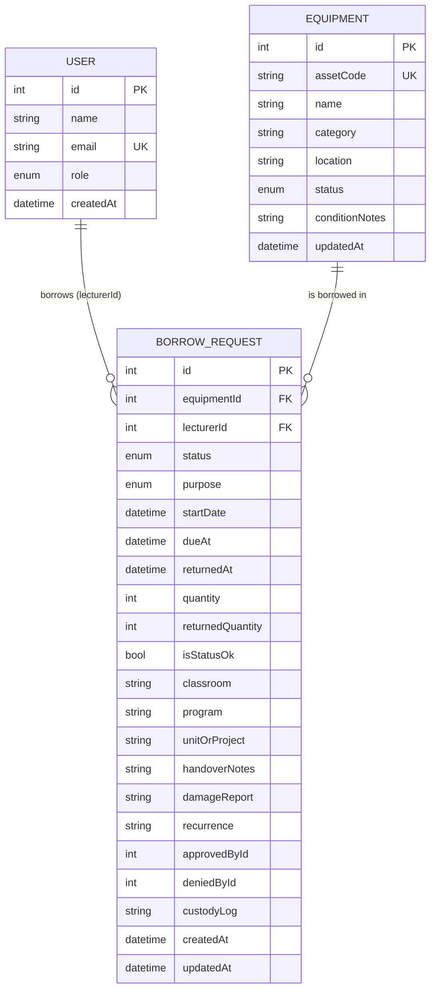
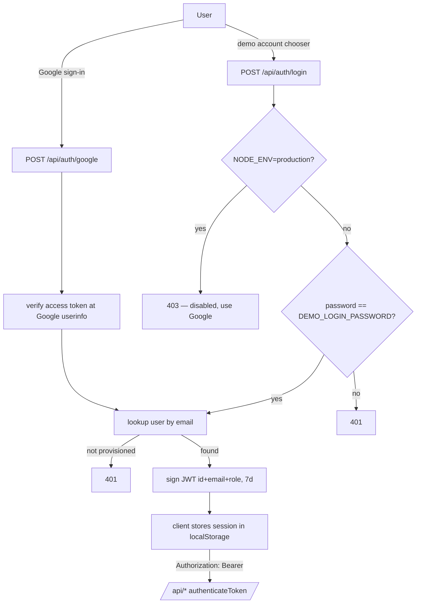
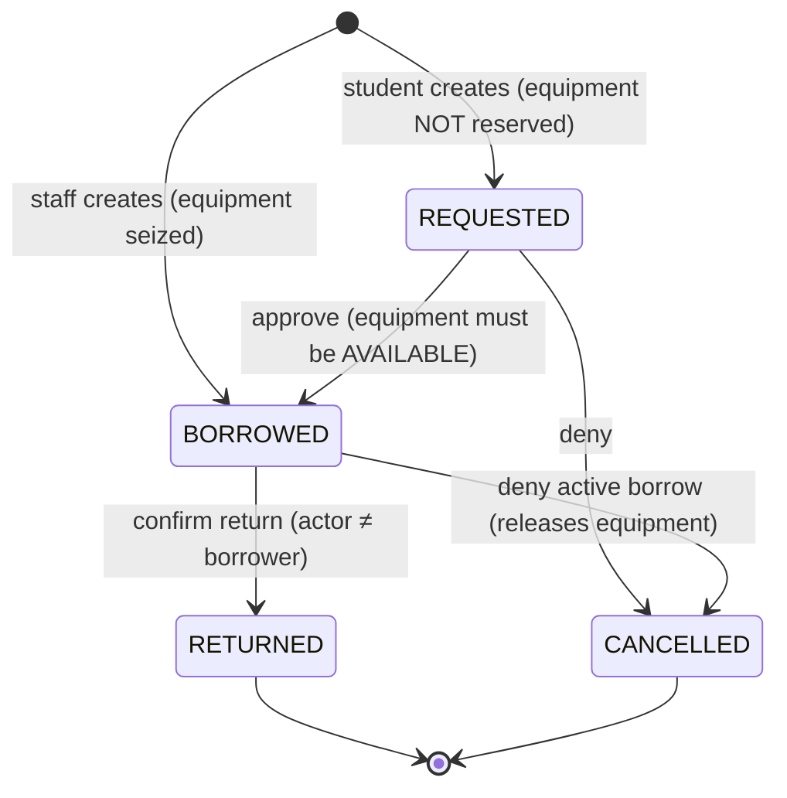
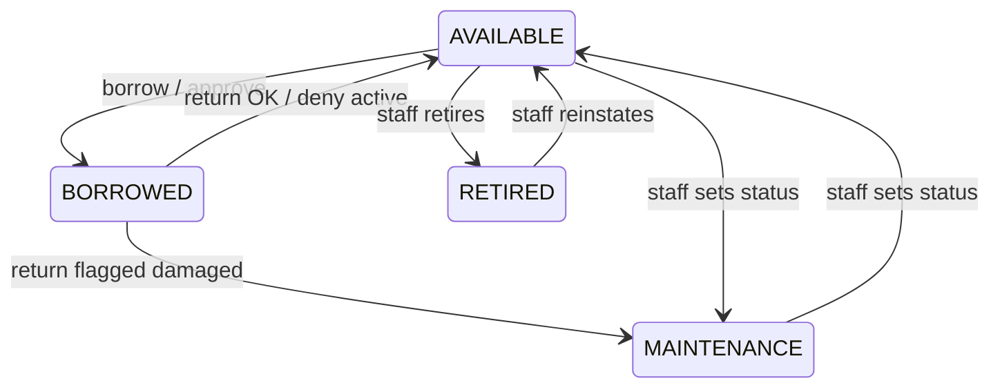
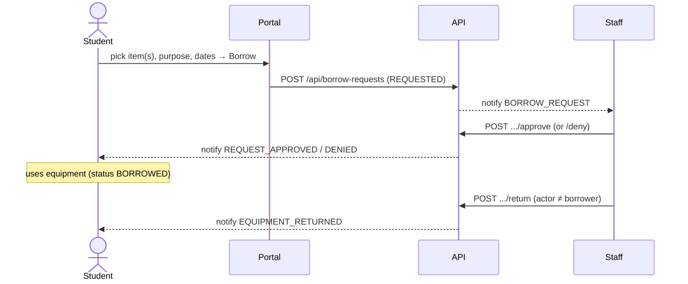

# Swinburne Equipment Portal — System Documentation

Complete reference for the **logic**, **workflows**, and **features** of the equipment borrowing portal. Grounded in the source and reflecting the current (post security-hardening) behaviour.

---

## 1. Overview

A university equipment-borrowing portal. Staff and students browse equipment, request or directly borrow items, route requests through approval, track an availability calendar, confirm returns, log chain-of-custody, and receive notifications. Six roles carry differentiated authority.

| | |
|---|---|
| Client | Vue 3 + Vite SPA |
| Server | Express 5 (ESM) |
| Data | MySQL via Prisma — with an in-memory fallback repository for demos |
| Auth | Google OAuth 2.0 (real) + demo credential login (dev only); stateless JWT |
| Notifications | Nodemailer (SMTP when configured, otherwise logged) |

### Repository / branch model

| Branch | Folder | Build | Purpose |
|---|---|---|---|
| `demo` | `demo/` | full-stack (`server/` + `prisma/`) | Complete system — **this document** |
| `production` | `production/` | frontend-only (`client/src/store.js` browser mock) | Public Vercel demo, no backend |

The two branches diverged intentionally: `production` is a backend-less static build where `store.js` reproduces the API contract in the browser; `demo` is the real client + server + database.

---

## 2. Architecture



Repository selection (`createRepository()`): returns `PrismaRepository` when `DATABASE_URL` is set **and** `USE_DEMO_STORE !== "true"`, otherwise the in-memory `DemoRepository`. Both implement an identical interface, so the API behaves the same with or without a database.

---

## 3. Domain Model



### Enumerations

| Enum | Values |
|---|---|
| `UserRole` | STUDENT, LECTURER, SUPPORT, ADMIN, OPERATIONS, EVENT_STAFF |
| `BorrowPurpose` | CLASSROOM, LAB, RESEARCH, EVENT |
| `EquipmentStatus` | AVAILABLE, BORROWED, MAINTENANCE, RETIRED |
| `BorrowStatus` | REQUESTED, APPROVED*, BORROWED, RETURNED, CANCELLED |

> **Implementation notes / known limitations**
> - `BorrowRequest.lecturerId` is the **borrower** for every role (the field is named for the original lecturer-only design). \*`APPROVED` is reserved but unused — approval transitions straight to `BORROWED`.
> - `approvedById` / `deniedById` are plain ints with no foreign key.
> - `custodyLog` is a JSON **string**, not a relation.
> - Equipment has a single status, no per-unit stock count (`quantity` on a request is stored but not enforced against availability).
> - Notifications are an in-memory ring buffer shared across users (not persisted, not per-recipient).
>
> These map directly to the Wave-0/Wave-2 items in the feature roadmap.

---

## 4. Roles & Capabilities (RBAC)

Authorisation is a centralised capability matrix (`CAPABILITIES` in `server/src/index.js`); each protected mutation is guarded by `requireCapability(...)`.

| Capability | STUDENT | LECTURER | EVENT_STAFF | SUPPORT | OPERATIONS | ADMIN |
|---|:--:|:--:|:--:|:--:|:--:|:--:|
| `APPROVE_REQUEST` | – | ✓ | ✓ | ✓ | ✓ | ✓ |
| `DENY_REQUEST` | – | ✓ | ✓ | ✓ | ✓ | ✓ |
| `CONFIRM_RETURN` | – | ✓ | ✓ | ✓ | ✓ | ✓ |
| `SEND_REMINDER` | – | ✓ | ✓ | ✓ | ✓ | ✓ |
| `MANAGE_EQUIPMENT` (status / maintenance / retire) | – | – | – | ✓ | ✓ | ✓ |

**Student self-service** (no capability needed, guarded by `loadOwnRequest` — owner-only): create a borrow **request**, edit / extend / add custody to **their own** request, view **their own** history.

**Separation of duties:** even a capable staff member cannot confirm the return of an item **they** borrowed (`actor ≠ borrower`), enforced at the route and again in the repository.

The client mirrors this matrix (`canManageEquipment`, `canConfirmReturn` in `AppShell.vue`) to hide tabs/buttons a role cannot use.

---

## 5. Authentication & Security Model



- **Two login paths.** Google OAuth is the real authentication path. The email/password endpoint is a **demo shim** (the UI is a Google-account chooser that posts the shared demo password).
- **Production hardening.** The credential endpoint returns `403` when `NODE_ENV=production` — production accepts Google OAuth only.
- **JWT.** HS256, 7-day expiry, payload `{ id, email, role }`. Secret comes from `JWT_SECRET`; the server **refuses to boot in production** without it and uses a random ephemeral secret in development (no committed fallback).
- **Provisioning.** Only seeded users can log in — an unknown email yields `401` on both paths.
- **Every `/api/*` route except auth** passes through `authenticateToken` (invalid/expired token → `403`).

---

## 6. Business Logic

### 6.1 Borrow request lifecycle



| Transition | Rule |
|---|---|
| **Create (student)** | status `REQUESTED`; equipment **not** locked (multiple students may queue). |
| **Create (staff)** | status `BORROWED`; equipment must not be `RETIRED`; equipment → `BORROWED`. |
| **Approve** | only from `REQUESTED`; equipment must be `AVAILABLE` (else 409); → `BORROWED`; equipment → `BORROWED`; records `approvedById`. |
| **Deny** | from `REQUESTED` or `BORROWED` → `CANCELLED`; if it was `BORROWED`, equipment → `AVAILABLE`; records `deniedById`. |
| **Confirm return** | only from `BORROWED`; **actor ≠ borrower**; `isStatusOk` → equipment `AVAILABLE`, else `MAINTENANCE` (+ damage report); appends a custody entry. |
| **Extend** | only `BORROWED` **and** `purpose=RESEARCH`; new `dueAt` or default +7 days. |
| **Edit** | only `REQUESTED` or `BORROWED`; editable: classroom, dueAt, handoverNotes, purpose, program, unitOrProject, quantity, startDate, recurrence. |

### 6.2 Equipment status lifecycle



`RETIRED` equipment cannot be borrowed (409). Status changes other than the automatic borrow/return transitions require `MANAGE_EQUIPMENT`.

### 6.3 Validation (zod)

| Schema | Rules |
|---|---|
| `loginSchema` | `email` valid email, `password` ≥ 1 char |
| `borrowSchema` | `equipmentId` positive int; `dueAt` ISO datetime; `purpose` ∈ enum; `quantity` positive int; `startDate` ISO?; string length caps (classroom 40, notes 240, program/unit 100) |
| `editSchema` | same field caps, all optional |
| `custodySchema` | action ≤ 40, actor ≤ 120, notes ≤ 240 |
| `statusSchema` | `status` ∈ EquipmentStatus; `conditionNotes` 2–240 chars |

A borrow body may be a **single object or an array** (batch borrow / multi-item cart).

### 6.4 Notifications

`sendNotification({ to, type, subject, message, meta })` records an entry in an in-memory ring buffer (max 100) and delivers via Nodemailer — real SMTP when `SMTP_HOST` is set, otherwise a JSON/console transport. Event types fired today:

`BORROW_REQUEST`, `EQUIPMENT_BORROWED`, `REQUEST_APPROVED`, `REQUEST_DENIED`, `BORROW_EXTENDED`, `EXTENSION_REQUEST`, `EQUIPMENT_RETURNED`, `OVERDUE_REMINDER`.

Staff-targeted events fan out to all non-student users; borrower-targeted events go to the request owner.

---

## 7. Workflows

### 7.1 Student — request → use → return

1. Browse **Equipment**; open **Borrow Equipment**; add available items to the cart; choose purpose, dates (and program/unit/classroom as required).
2. Submit → a `REQUESTED` borrow is created; equipment stays available; staff are notified.
3. Track on the **Dashboard** ("my active requests"); edit or withdraw while `REQUESTED`/`BORROWED`.
4. After approval, the item is `BORROWED`. Return is confirmed by **staff** (separation of duties); the student is notified.
5. View past borrows under **History** (scoped to the student).

### 7.2 Staff — approvals & desk operations
- **Dashboard** surfaces pending approvals, overdue, and near-due items.
- **Approve / Deny** requests (`APPROVE_REQUEST` / `DENY_REQUEST`); approval requires the equipment to be available.
- **Confirm Return** (`CONFIRM_RETURN`): pick the borrowed item, mark OK or damaged (+ note); OK → available, damaged → maintenance; cannot return your own borrow.
- **Send reminder** on overdue items (`SEND_REMINDER`).
- **Borrow directly** (staff create skips approval and immediately checks the item out).
- **Extend** research borrows; **edit** request details; **log custody** for EVENT items.

### 7.3 Inventory (SUPPORT / OPERATIONS / ADMIN)
- **Update Status** (`MANAGE_EQUIPMENT`): move equipment between AVAILABLE / MAINTENANCE / RETIRED with condition notes. (Hidden from LECTURER/EVENT_STAFF/STUDENT.)

### 7.4 Scheduling
- **Schedules** renders a per-equipment availability calendar from active (`REQUESTED`/`BORROWED`) bookings (`start = startDate ?? createdAt`, `end = dueAt`) and supports booking a slot, which emits a borrow.

---

## 8. Feature Catalogue

**Authentication & session**
- Google OAuth 2.0 sign-in; demo account chooser (dev only); 7-day JWT session in `localStorage`; campus selector at login; logout.

**Dashboard**
- Role-aware widgets: pending approvals, overdue, near-due (staff); "my active requests" with inline edit / return / extend / custody (all users); summary cards (total, available, borrowed, maintenance, active requests).

**Equipment**
- Catalogue list with asset code, category, location, status chip, condition notes, and latest-request context.

**Borrowing**
- Single or multi-item (cart) borrow; purposes CLASSROOM / LAB / RESEARCH / EVENT; per-purpose fields (program, unit/project, classroom); recurrence field; start/due dates; student requests vs staff direct check-out.

**Approvals**
- Approve / deny with availability guard; approver/denier recorded; notifications to borrower; staff fan-out on new requests.

**Returns**
- Confirm return with OK / damaged outcome, returned quantity, damage report; auto-routes equipment to available or maintenance; separation-of-duties enforcement; chain-of-custody entry appended.

**Lifecycle actions**
- Extend (research only); edit pending/active request; manual chain-of-custody logging; overdue reminder.

**Scheduling**
- Per-equipment availability calendar; slot booking; conflict-visible bookings.

**History**
- Full borrow-history log with search, status & purpose filters, sortable columns, and pagination (students scoped to their own records).

**Notifications**
- In-app notification bell; email via Nodemailer (SMTP or logged); 8 lifecycle event types.

**Inventory management**
- Equipment status / maintenance / retire (capability-gated).

**Security & access control**
- Capability-based RBAC matrix; JWT auth on all data routes; production credential-login lockout; fail-fast on missing JWT secret; owner-only self-service; separation of duties on returns.

---

## 9. API Reference

All `/api/*` routes except the three auth endpoints require `Authorization: Bearer <jwt>`.

| Method | Path | Guard | Purpose |
|---|---|---|---|
| GET | `/api/health` | public | store mode + liveness |
| POST | `/api/auth/login` | public (dev only) | demo credential login |
| POST | `/api/auth/google` | public | Google OAuth login |
| POST | `/api/auth/logout` | public | no-op (stateless) |
| GET | `/api/summary` | auth | dashboard counts |
| GET | `/api/equipment` | auth | catalogue + latest request |
| GET | `/api/equipment/:id/schedule` | auth | availability bookings |
| GET | `/api/borrow-requests` | auth | active requests |
| GET | `/api/notifications?limit` | auth | recent notifications |
| GET | `/api/users/:id/borrow-history` | auth (own if student) | a user's history |
| GET | `/api/borrow-history` | auth (own if student) | filtered/paged history |
| POST | `/api/borrow-requests` | auth | borrow (object or array) |
| PATCH | `/api/borrow-requests/:id` | owner | edit request |
| POST | `/api/borrow-requests/:id/approve` | `APPROVE_REQUEST` | approve |
| POST | `/api/borrow-requests/:id/deny` | `DENY_REQUEST` | deny |
| POST | `/api/borrow-requests/:id/extend` | owner | extend (research) |
| POST | `/api/borrow-requests/:id/custody` | owner | add custody entry |
| POST | `/api/borrow-requests/:id/remind` | `SEND_REMINDER` | overdue reminder |
| POST | `/api/borrow-requests/:id/return` | `CONFIRM_RETURN` + actor≠borrower | confirm return |
| PATCH | `/api/equipment/:id/status` | `MANAGE_EQUIPMENT` | change equipment status |
| GET | `/api/sprints` | auth | sprint plan reference |

---

## 10. Configuration

| Variable | Required | Notes |
|---|---|---|
| `PORT` | no | API port (default 4000) |
| `CLIENT_ORIGIN` | no | CORS origin (default `http://127.0.0.1:5173`) |
| `DATABASE_URL` | for MySQL mode | absent → in-memory demo store |
| `USE_DEMO_STORE` | no | `true` forces the in-memory store even with `DATABASE_URL` |
| `JWT_SECRET` | **yes in production** | server refuses to boot in prod if unset; random ephemeral in dev |
| `NODE_ENV` | recommended | `production` enables fail-fast + Google-only login |
| `DEMO_LOGIN_PASSWORD` | no | password the demo chooser must send (default `demo`) |
| `SMTP_HOST` / `SMTP_PORT` / `SMTP_SECURE` / `SMTP_USER` / `SMTP_PASS` / `MAIL_FROM` | no | real email delivery; otherwise notifications are logged |
| `VITE_GOOGLE_CLIENT_ID` (client) | for real Google login | otherwise the chooser falls back to demo accounts |

---

## 11. Run & Test

```bash
npm install
npm run dev            # client (5173) + server (4000)
npm run build          # server syntax check + client production build
npm --workspace server test   # security regression suite (auth, JWT, RBAC, SoD)
# MySQL mode:
npm run prisma:generate && npm run prisma:migrate && npm run prisma:seed
```

Demo accounts use the password `demo`. Without `DATABASE_URL` the server runs entirely from the in-memory store.
